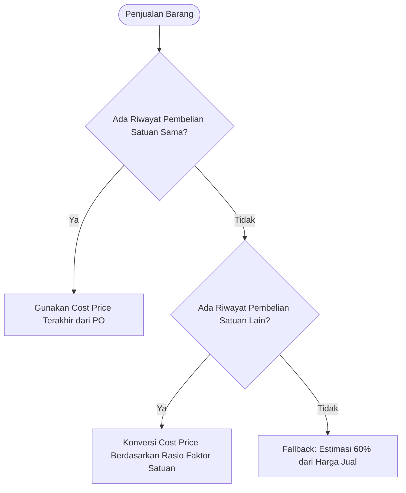

# Dokumentasi Perhitungan HPP (Harga Pokok Penjualan) - GawePOS

Dokumen ini menjelaskan alur, formula, dan logika perhitungan **HPP (Harga Pokok Penjualan)** serta **Laba Kotor (Gross Profit)** pada **Dashboard Eksekutif** dan **Laporan Laba Rugi (P&L)** di aplikasi GawePOS.

---

## 1. Rumus Utama

### A. Total HPP Bersih
$$\text{HPP Bersih} = \sum (\text{Qty Terjual} \times \text{Harga Pokok Unit}) - \sum (\text{Qty Retur Penjualan} \times \text{Harga Pokok Unit})$$

### B. Laba Kotor (Gross Profit)
$$\text{Laba Kotor} = \text{Omzet Penjualan Bersih} - \text{HPP Bersih}$$

---

## 2. Logika Penentuan Harga Pokok Unit (`getProductCostPrice`)

Implementasi kode berada pada file [`lib/features/reports/data/reports_repository.dart`](file:///Users/mac/Adam%20Adifa/Project/posmobile/lib/features/reports/data/reports_repository.dart#L9-L46). Sistem menggunakan mekanisme **3-Tier Hierarchy / Fallback**:

### 1. Prioritas 1 — Riwayat Pembelian dengan Satuan Sama
Sistem memeriksa tabel `purchase_items` untuk mencari transaksi restok / pembelian terakhir dari produk dengan `unit_id` yang sama persis dengan yang terjual di kasir.
* **Harga Pokok** = `purchaseItem.costPrice`

### 2. Prioritas 2 — Konversi Multi-Satuan Otomatis
Jika barang dijual dalam satuan berbeda (misal: dijual per *Pcs*, tapi riwayat kulakan dicatat per *Dus/Karton*):
Sistem mengambil harga beli satuan lain, lalu mengonversinya secara proporsional sesuai rasio faktor konversi (`conversionFactor`):
$$\text{Harga Pokok Satuan Dasar} = \frac{\text{Harga Beli Satuan Lama}}{\text{Faktor Konversi Satuan Lama}}$$
$$\text{Harga Pokok Satuan Jual} = \text{Harga Pokok Satuan Dasar} \times \text{Faktor Konversi Satuan Jual}$$

### 3. Prioritas 3 — Fallback Default (Estimasi Standar UMKM)
Jika produk merupakan barang baru yang **belum pernah dicatat riwayat pembelian/kulakannya** di sistem:
Sistem menggunakan estimasi standar modal sebesar **60% dari Harga Jual** (asumsi margin laba kotor 40%):
$$\text{Harga Pokok} = \text{Harga Jual} \times 60\%$$

---

## 4. Visualisasi pada Dashboard Eksekutif

Pada [`lib/features/reports/presentation/pages/owner_dashboard_page.dart`](file:///Users/mac/Adam%20Adifa/Project/posmobile/lib/features/reports/presentation/pages/owner_dashboard_page.dart):
* **Executive Summary Card**: Menampilkan total nominal Beban Pokok (HPP) dengan tombol dialog bantuan interaktif.
* **Financial Cashflow Breakdown**: Diagram batang warna *Amber* (`#F59E0B`) yang mengilustrasikan persentase HPP terhadap total omzet kotor sebelum dikurangi biaya operasional (*expenses*).
